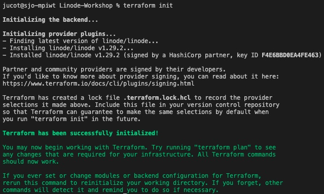
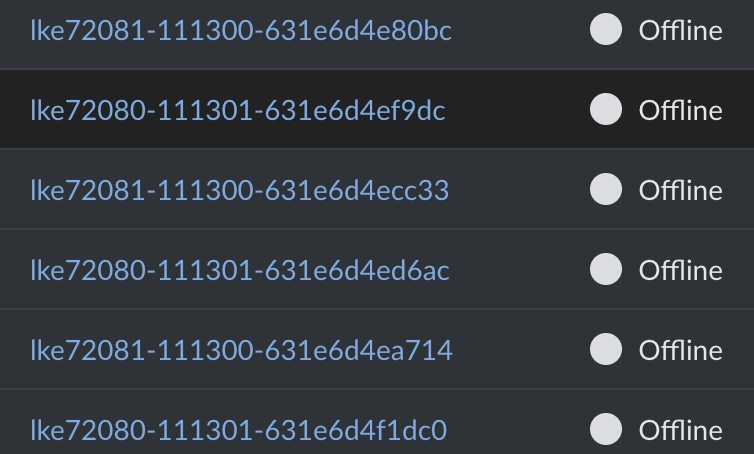
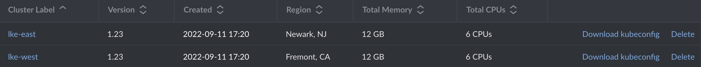
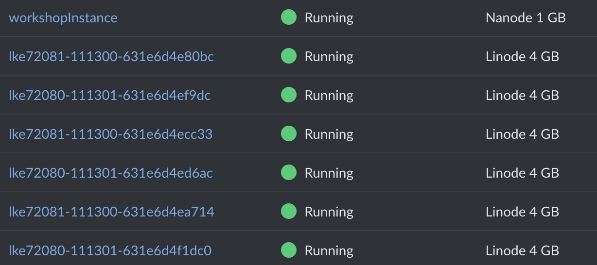
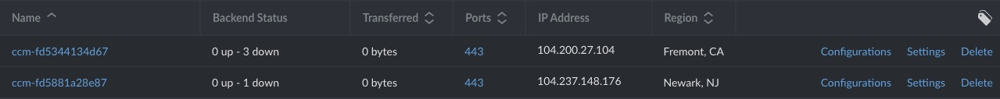

# automated-linode-failover-workshop
A way of setting up the linode-workshop lab in single operation by using Terraform.
Lab reference: https://github.com/akamai/linode-failover-workshop

# Requirements:

--> install terraform (this setup was made with Terraform v1.2.8)
https://www.terraform.io/downloads

Optional:

-->VisualStudio Code

# Deploy Instructions

1-Download the folder either through the UI or by pulling the git repository. Make sure the files are in an isolated folder, as it will be the Terraform working directory. If you list the files, you should see something similar as the following:


```
-rw-r--r--  1 jucot  staff  2575 Sep 11 17:57 labsetup.sh
-rw-r--r--  1 jucot  staff  1034 Sep 11 17:10 linode-failover-workshop.tf
drwxr-xr-x  4 jucot  staff   128 Aug 29 12:25 ssh-keys
-rw-r--r--  1 jucot  staff   103 Sep  4 20:37 terraform.tfvars
```

2-Move to that folder through the command line or by opening the folder on VS Code. Then edit file labsetup.sh. In line #30, add your Linode Token.

``` bash

echo 'export TF_VAR_token="<Type your linode token here>"' >> .bashrc #Inserting your linode token as an env variable on remote host.

```

3-Edit file terraform.tfvars, add a root password for the Linode instance and add the Linode token there as well:

```
token = ""
root_pass = ""
```

4- Then, once the edits are completed, move to the folder and run terraform init:

```
terraform init
```



5-Then, to deploy the lab, just run terraform apply. You can run terraform plan to verify if the setup will be made as expected.

```bash
terraform apply #then answer yes
terraform apply --auto-approve #bypass approval prompt.
```

6-To login to the linode instance from where the kubernetes setup is made, a user spaceU is created. 
Just make sure to change the default keys permissions:

```bash
chmod 700 ssh-keys 
chmod 600 ssh-keys/workshopK*
```

In order to login you can issue command:


```bash
ssh -i ssh-keys/workshopK spaceU@<public-ip-of-Linode-instance> #Considering your current directory is where ssh-keys folder are.
```

Notice that paswordless ssh keys have been added for easy of use, however if you consider this insecure (which it is) you can provide/create your own keys, just make sure to edit the linode-failover-workshop.tf file on line 53

```HCL
resource "linode_sshkey" "workshop_key" {
  label = "workshopkey"
  ssh_key = chomp(file("ssh-keys/workshopK.pub"))
}
```

# What to expect in regards to the deployment

Once terraform apply starts running the first thing that will come up on our Linode UI will be an instance called workshop instance, from which the kubernetes setup will be triggered:


It takes around one minute, and after that, we should start seeing the individual worker nodes that are part of the 2 clusters, 6 in total.





Then, after another 2 minutes each worker node should boot and move to running status. 



Finally, if we check the nodebalancers, there should be 2 nodebalancers up. They may show the worker nodes as down for some time, as it takes time to run and start the healthchecks. The websites should be available at this point, so if you try any of the urls you should get a response.



Please notice the setup will take less of more time depending on Linode aspects that are not controllable. 
Sometimes the Linode UI doesnt refresh right away, so start refreshing and give some time to complete.

The lab can take between 5 to 10 minutes to complete. 


# Clean Up part

1-Login to the machine as spaceU user (remember to change the ssh-keys file permissions).

2-Switch to root user and then move to root home path:

```bash
sudo su
```

then

```bash
cd ~
```

3-Execute the clean.sh script. This will remove:

nodebalancers
kubernetes cluster


```bash
./clean.sh
```


Wait for it to finish.

Sometimes, 1 or 2 worker nodes will need to be deleted manually, just delete them from linodes dashboard.

4-From your local machine, run terraform destroy to delete the workshopinstance linode.


